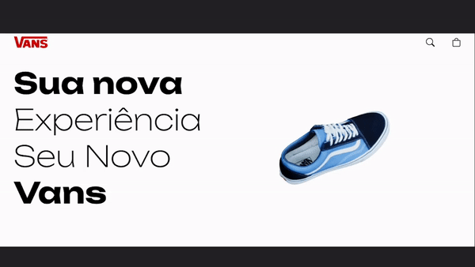

# Trabalho Marcio 18 05 2023 - Loja Virtual

> Trabalho do Professor Marcio, dia 18 05 2023, simular uma página para a venda de produtos de uma loja virtual de produtos 3D



# Aplicação

# Iniciando a Aplicação

Abra o seu terminal na raiz do projeto e instale as dependencias usando o código:
```bash
npm install
```

Em seguida, inicie a aplicação usando o código:
```bash
npm start
```

# Nome

<table>
  <tr>
    <td align="center">
        <sub>
          <b>Matheus Rocha Teixeira Alba Cuadrado - 22665</b>
        </sub>
      </a>
    </td>
  </tr>
</table>

# Tecnologias Utilizadas

As tecnologias que foram utilizadas para o desenvolvimento foram:
ThreeJS;
ReactJS;
Modelo 3D "Unused Blue Vans Shoe";
Styled Components;
React Icons.

# Licença
The MIT License (MIT)

Copyright (c) 2023 Matheus Rocha Teixeira Alba Cuadrado

Permission is hereby granted, free of charge, to any person obtaining a copy of this software and associated documentation files (the "Software"), to deal in the Software without restriction, including without limitation the rights to use, copy, modify, merge, publish, distribute, sublicense, and/or sell copies of the Software, and to permit persons to whom the Software is furnished to do so, subject to the following conditions:

The above copyright notice and this permission notice shall be included in all copies or substantial portions of the Software.

THE SOFTWARE IS PROVIDED "AS IS", WITHOUT WARRANTY OF ANY KIND, EXPRESS OR IMPLIED, INCLUDING BUT NOT LIMITED TO THE WARRANTIES OF MERCHANTABILITY, FITNESS FOR A PARTICULAR PURPOSE AND NONINFRINGEMENT. IN NO EVENT SHALL THE AUTHORS OR COPYRIGHT HOLDERS BE LIABLE FOR ANY CLAIM, DAMAGES OR OTHER LIABILITY, WHETHER IN AN ACTION OF CONTRACT, TORT OR OTHERWISE, ARISING FROM, OUT OF OR IN CONNECTION WITH THE SOFTWARE OR THE USE OR OTHER DEALINGS IN THE SOFTWARE.